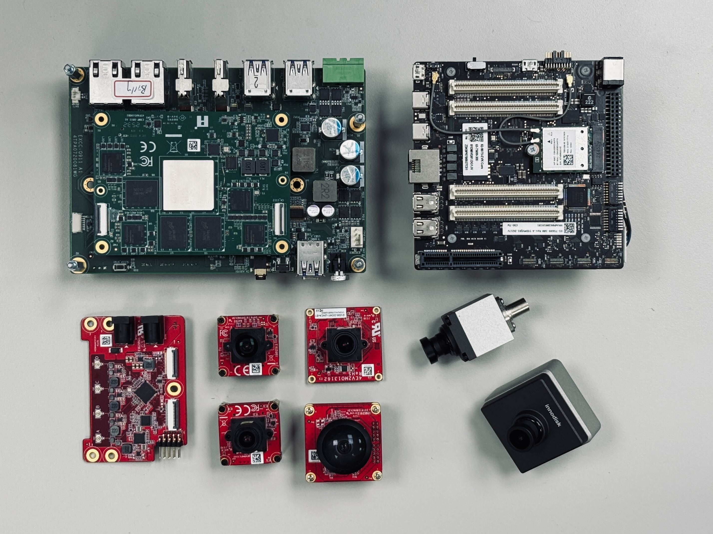

# iQ-Cam
iQ-Cam is a project designed to generate CHI-CDK compatible patches for Qualcomm-based camera systems. It provides a modular environment to configure, build, and deploy CHI-CDK patches easily, with utilities for debugging, XML modification, and packaging into .tar.gz.

## BSP Support

This repo supports the following Q911 BSP versions (from the [meta-iQ__manifest](https://github.com/InnoIPA/meta-iQ__manifest) repository):

| BSP Version | QLI version | iQ-Cam Version         | Tested |
| ----------- | ----------- | ---------------------- | ------ |
| **v2.1.0**  | v1.6        | v1.1.4, v1.1.5, v1.1.6 | ✅     |
| **v2.3.0**  | v1.8        | -                      | -      |
| **v2.3.1**  | v1.8        | -                      | -      |
| **v2.3.2**  | v1.8        | v2.0.0                 | ✅     |
| **v2.3.3**  | v1.8        | -                      | -      |

> **Note:** Although **v2.3.0**, **v2.3.1**, and **v2.3.3** have not been explicitly tested, they are all based on QLI 1.8, so they should work without issues.

## Supported Interfaces

### [MIPI Camera](doc/common/mipi.md)
MIPI CSI-2 is a widely adopted, high-bandwidth, and low-latency interface ideal for short-range connections between image sensors and the processor.

- **Best for:** Edge AI devices, robotics, industrial automation, and scenarios where cameras are physically close to the processing board.
- **Key Features:** Multi-gigabit throughput, low power consumption, and broad sensor compatibility.
- **Documentation:** [Read the MIPI Camera Guide](doc/common/mipi.md)

### [GMSL Camera](doc/common/gmsl.md)
Gigabit Multimedia Serial Link (GMSL) is a robust interface that allows high-speed video transmission over single coaxial cables for long distances (up to 10–15 meters).

- **Best for:** Autonomous driving, 360° surround-view stitching, industrial mobile equipment, and scenarios requiring cameras to be placed several meters away from the platform.
- **Key Features:** Long-distance transmission, high reliability, and excellent multi-channel real-time support.
- **Documentation:** [Read the GMSL Camera Guide](doc/common/gmsl.md)

---

> 💡 **Need help choosing?**
> - If your cameras will be mounted directly on or very close (within a few tens of centimeters) to the main board, **[MIPI](doc/common/mipi.md)** is the standard choice.
> - If you need to place cameras far away from the system or are using long coaxial cables, **[GMSL](doc/common/gmsl.md)** is the required solution. 

## Release Notes
| Version | Key Changes |
| :--- | :--- |
| **v2.0.0** | Upgraded to Yocto QLI 1.8 (dropped Ubuntu and MZB targets); fixed EVDF-OOM1 GMSL probe sequence; added HTML porting guide site; removed iQ-9075 EVK from documentation — EXEC-Q911 is now the only documented evaluation kit. |
| **v1.1.6** | Added `build_deploy_test.sh` end-to-end build/deploy/capture script and Claude Code workflow skills; imported vendor reference docs (Qualcomm 1.6/1.8 Camera Guide, GMSL2, MAX96724, MAX9295D); added EV3F-ZSM1 PP19 known-good baseline and `doc/common/verify.md`; public-mirror sync now clears `release/*` before copying. |
| **v1.1.5** | Removed Ubuntu support from documentation; updated BSP support section; removed expired release packages. |
| **v1.1.4** | Updated GitHub Actions workflows for automatic public repository synchronization; added `DEVELOPMENT.md`. |
| **v1.1.3** | Added colorbar mode for EV8M-OOM1. |
| **v1.1.2** | Added colorbar mode for EV2M-OOM3. |
| **v1.1.1** | Added support for EXMA-Q911 (QLI 1.7) and bring up EV2M-OOM3 on Generic I2C/V4L2. |
| **v1.1.0** | Upgraded to QLI 1.6; added support for EV3F-ZSM1 and EV8M-OOM1; supported 8 channels for GMSL. |
| **v1.0.0** | Initial release with support for EVDF-OOM1, ox03f10, EVDM-OOM1, and EV2M-OOM3. |

## Release Packages
The `release/` directory contains all generated .tar.gz files, which can be installed on compatible devices.
Below is the list of available release packages:

| Module Name                                                                                                                                                | Phy Type | Support Resolution |
| ---------------------------------------------------------------------------------------------------------------------------------------------------------- | -------- | ------------------ |
| [ev2m_oom3](https://www.innodisk.com/en/products/camera/mipi-csi-2/ev2m-oom3-rhcf)                                                                         | DPHY     | `1920x1080,30FPS`  |
| [ev8m_oom1](https://www.innodisk.com/en/products/camera/mipi-csi-2/ev8m-oom1-rhcf)                                                                         | DPHY     | `1920x1080,30FPS`  |
| [evdm_oom1](https://www.innodisk.com/en/products/camera/mipi-csi-2/evdm-oom1-rhcf)                                                                       | DPHY     | `1920x1080,30FPS`  |
| [ev3f_zsm1](https://www.innodisk.com/en/products/camera/gmsl2/ev3f-zsm1-rxcf)_[pp19](https://www.innodisk.com/en/products/camera/adapter-board/eb022-2m4f) | DPHY     | `1920x1536,30FPS`  |
| [evdf_oom1](https://www.innodisk.com/en/products/camera/gmsl2/evdf-oom1-rhcf)_[pp19](https://www.innodisk.com/en/products/camera/adapter-board/eb022-2m4f) | DPHY     | `1920x1080,30FPS`  |

> **Note - Colorbar Mode:** Some release packages are available with a `_colorbar` suffix (e.g., `ev2m_oom3_colorbar`). In this mode, the only difference is that the output image uses a colorbar; all other behavior is the same as the standard mode.

## License
This project is licensed under the terms specified in the [LICENSE](LICENSE) file.