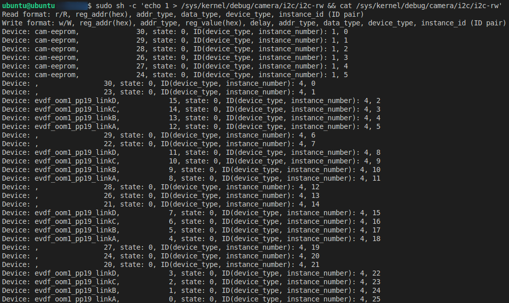
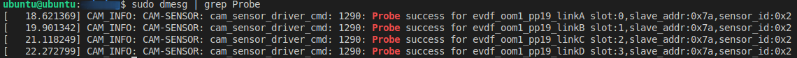

1. How can I check the current CHI-CDK slot configuration ?  
    ```bash
    mount -t debugfs debugfs /sys/kernel/debug
    echo 1 > /sys/kernel/debug/camera/i2c/i2c-rw && cat /sys/kernel/debug/camera/i2c/i2c-rw
    ```  
    Then you will get the log like below:
    
2. How can I verify which driver is currently loaded for the CHI-CDK slot ?  
    ```bash
    dmesg | grep Probe
    ```
    Then you will get the log like below:
    
3. How to reload CHI-CDK's driver ?  
    ```bash
    pkill cam-server
    ```
    And you can check the dmesg at the same time.