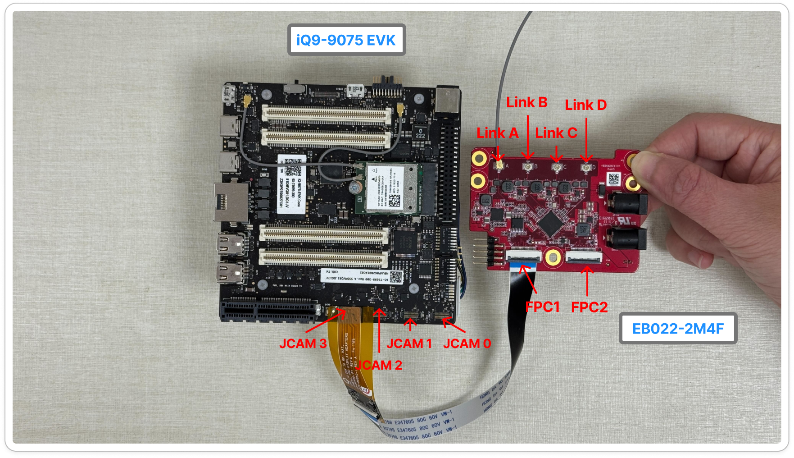
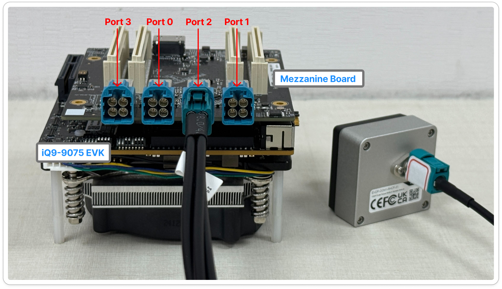
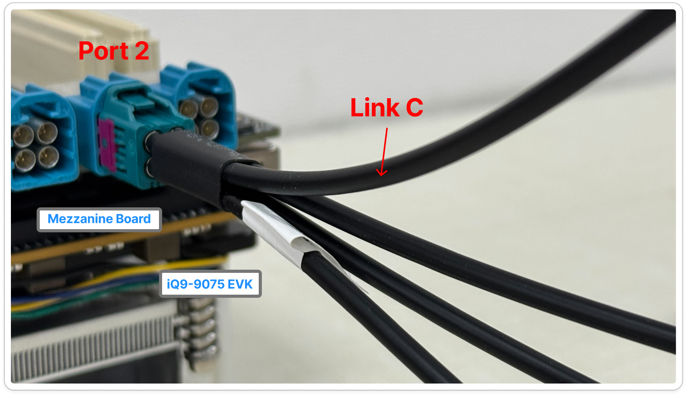
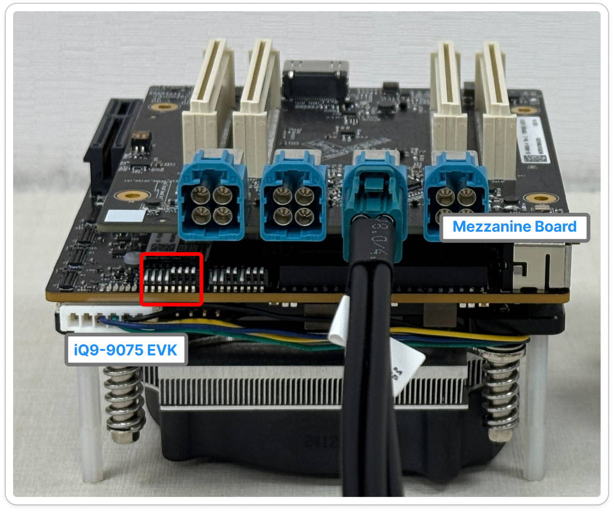
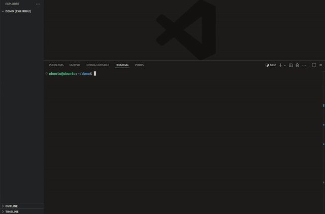

# GMSL Camera

GMSL provides a highly flexible interface for camera installation. 

Unlike MIPI CSI-2, which typically supports only short-range connections of several tens of centimeters, GMSL enables long-distance video transmission up to 10–15 meters over a single coaxial cable. This allows cameras to be placed several meters away from the platform while maintaining low latency and high reliability.

GMSL is widely used in autonomous driving, industrial mobile equipment, 360° surround-view stitching, and multi-channel real-time AI recognition applications.

## Supported Components

To build a GMSL vision system, the following components are required:

- **Cameras**: [EVDF-OOM1](https://www.innodisk.com/en/products/camera/gmsl2/evdf-oom1-rhcf), [EV3F-ZSM1](https://www.innodisk.com/en/products/camera/gmsl2/ev3f-zsm1-rxcf)
- **Adapter Boards**: [EB022-2M4F](https://www.innodisk.com/en/products/camera/adapter-board/eb022-2m4f)
- **Evaluation Kits**: [EXEC-Q911](https://www.innodisk.com/cht/products/computing/qualcomm-solution/EXEC-Q911), [iQ-9075 EVK](https://www.qualcomm.com/developer/hardware/qualcomm-iq-9075-evaluation-kit-evk)
- **Mezzanine Board**: [Qualcomm GMSL Mezzanine](https://docs.qualcomm.com/bundle/resource/topics/80-70020-17A/connect-camera-sensor-hardware.html)
- **Operating Systems**: [Yocto Linux 1.6](https://docs.qualcomm.com/doc/80-70022-254/topic/build_addn_info.html?product=895724676033554725&version=1.6)

## Camera Matrix
 
Specific connection procedures vary depending on the target platform. Follow the instructions below for your specific hardware. 

### 1. Connecting to EXEC-Q911

The EXEC-Q911 supports multi-channel GMSL input via the EB022-2M4F adapter board.

| Module    | Support Platform | Adapter Board | Supported OS                        | CN_CSI1 | CN_CSI2 | Resolution, Frame Rate |
| --------- | ---------------- | ------------- | ----------------------------------- | ------- | ------- | ---------------------- |
| EVDF-OOM1 | EXEC-Q911        | EB022-2M4F    | Yocto Linux 1.6  | ✅      | ✅      | 1920x1080, 30 FPS      |
| EV3F-ZSM1 | EXEC-Q911        | EB022-2M4F    | Yocto Linux 1.6 | ✅      | ✅      | 1920x1536, 30 FPS      |

> ✅ Supported | ❌ Not supported | ☑️ Coming soon

<div align="center">
  
</div>

To connect the GMSL camera to the EXEC-Q911 using the EB022-2M4F adapter board, follow these steps:

1. Use a 22-pin to 22-pin MIPI cable (A-B style) to connect `CN_CSIx` on the platform to the corresponding `FPC1` header on the adapter. This specific cable type is essential for correct CSI lane alignment.
2. Power on the EB022-2M4F first, followed by the EXEC-Q911.

<br />
<br />

### 2. Connecting to iQ-9075 EVK (Adapter Board)

| Module    | Support Platform | Adapter Board | Supported OS                        | JCAM0 | JCAM1 | JCAM2 | JCAM3 | Resolution, Frame Rate |
| --------- | ---------------- | ------------- | ----------------------------------- | ----- | ----- | ----- | ----- | ---------------------- |
| EVDF-OOM1 | iQ-9075 EVK      | EB022-2M4F    | Yocto Linux 1.6 | ✅    | ✅    | ✅    | ✅    | 1920x1080, 30 FPS      |
| EV3F-ZSM1 | iQ-9075 EVK      | EB022-2M4F    | Yocto Linux 1.6 | ✅    | ✅    | ✅    | ✅    | 1920x1536, 30 FPS      |

> ✅ Supported | ❌ Not supported | ☑️ Coming soon

<div align="center">
  
</div>

To connect the camera to the iQ-9075 EVK using the EB022-2M4F adapter board, follow these steps:

1. Use a 22-to-30 pin adapter to connect the 22-pin to 22-pin MIPI cable (A-A style).
2. Connect `CN_CSIx` to the corresponding `FPC1` header. This cable type is required for proper CSI lane alignment.

<br />
<br />

### 3. Connecting to iQ-9075 EVK (Mezzanine Board)

The iQ-9075 EVK can be expanded with a GMSL Mezzanine board for direct GMSL integration.

| Module    | Adapter Board   | Supported OS                 | Port0 | Port1 | Port2 | Port3 | Resolution, Frame Rate |
| --------- | --------------- | ---------------------------- | ----- | ----- | ----- | ----- | ---------------------- |
| EVDF-OOM1 | Mezzanine Board | Yocto Linux 1.6    | ❌    | ❌    | ✅    | ❌    | 1920x1080, 30 FPS      |

> ✅ Supported | ❌ Not supported | ☑️ Coming soon

<div align="center">
  
</div>

To connect the iQ-9075 EVK to the mezzanine board, follow these steps:

1. Install the Mezzanine board onto the iQ-9075 EVK.
2. Connect the GMSL camera to `Link C`. Note that only `Link C` is supported, and the system can operate with one MIPI sensor at a time.

    <div align="center"></div>

3. Set the DIP switches according to the configuration shown below. For more detail on DIP switch settings, refer to the [Qualcomm Documentation](https://docs.qualcomm.com/bundle/resource/topics/80-70020-17A/connect-camera-sensor-hardware.html).
    
    <div align="center"></div>
    
4. Power on the iQ-9075 EVK.

### System Reference Diagrams

The following diagrams provide additional context for complex multi-camera and power configurations.

<div align="center">
  <table style="border: none;">
    <tr>
      <td align="center" style="border: none;">
        <br>
        <i>8-Channel Reference Diagram</i>
      </td>
      <td align="center" style="border: none;">
        <br>
        <i>PP19 Power Reference Diagram</i>
      </td>
    </tr>
  </table>
</div>

<br />
<br />

## How to Install
For detailed, step-by-step instructions for both Yocto Linux please refer to the **[Installation Guide](./install.md)**.

## How to Switch Modules

Please refer to **[Installation Guide](./install.md)**, reinstall the module package (tar.gz) you want to install, and then reboot the system to replace the module.

## How to Verify

For instructions on verifying that the camera is functioning correctly after installation, see the **[Verify Guide](./verify.md)**.

## How to Use

If the camera is properly connected and the required drivers are installed, you can use GStreamer to interact with the camera streams.

> 🔔 **Note:** For **Yocto Linux**, suppress kernel messages before running pipelines: `echo 0 > /proc/sys/kernel/printk`

If the file `/var/cache/camera/camxoverridesettings.txt` does not exist, please create it and add the following configuration:
```bash
HMSMaxDelayedJobCount=8
```

### 1. Single Channel Stream
To capture a single stream and encode it to MP4:
```bash
pkill cam-server && sleep 5
gst-launch-1.0 -e qtiqmmfsrc exposure-mode=off manual-exposure-time=10000000000 name=camsrc camera=0 ! \
'video/x-raw,width=1920,height=1080,framerate=30/1' ! \
videoconvert ! v4l2h264enc ! h264parse ! mp4mux ! filesink location=test.mp4
```

### 2. Multi Channel Stream

Switching between different cameras can be done by changing the index number after the `camera=` parameter.

> 🔔 **Note:**
> 1. `camera=1` must be enabled first before using `camera=0`.
> 2. Please wait more than 5 seconds between each `gst-launch` command.

### 3. Octuple Channel Stream
The following scripts demonstrate how to display 8 channel GMSL video streams.

#### Yocto Linux
<details>
<summary>EV3F-ZSM1 (8-Channel Display)</summary>

```bash
pkill cam-server && sleep 15 &&
GST_GL_API=gles2 XDG_RUNTIME_DIR=/dev/socket/weston WAYLAND_DISPLAY=wayland-1 \
gst-camera-per-port-example --custom <<EOF
1 0 2 3 5 4 6 7
1
1920
1536
30
1
1920
1536
30
1
1920
1536
30
1
1920
1536
30
1
1920
1536
30
1
1920
1536
30
1
1920
1536
30
1
1920
1536
30
qtiqmmfsrc exposure-mode=off manual-exposure-time=10000000000 name=camsrc1 camera=1 ! video/x-raw,format=NV12,width=1920,height=1536,framerate=30/1 ! videoconvert ! videoscale ! video/x-raw,width=480,height=384 ! fpsdisplaysink video-sink=glimagesink sync=false text-overlay=true
qtiqmmfsrc exposure-mode=off manual-exposure-time=10000000000 name=camsrc0 camera=0 ! video/x-raw,format=NV12,width=1920,height=1536,framerate=30/1 ! videoconvert ! videoscale ! video/x-raw,width=480,height=384 ! fpsdisplaysink video-sink=glimagesink sync=false text-overlay=true
qtiqmmfsrc exposure-mode=off manual-exposure-time=10000000000 name=camsrc2 camera=2 ! video/x-raw,format=NV12,width=1920,height=1536,framerate=30/1 ! videoconvert ! videoscale ! video/x-raw,width=480,height=384 ! fpsdisplaysink video-sink=glimagesink sync=false text-overlay=true
qtiqmmfsrc exposure-mode=off manual-exposure-time=10000000000 name=camsrc3 camera=3 ! video/x-raw,format=NV12,width=1920,height=1536,framerate=30/1 ! videoconvert ! videoscale ! video/x-raw,width=480,height=384 ! fpsdisplaysink video-sink=glimagesink sync=false text-overlay=true
qtiqmmfsrc exposure-mode=off manual-exposure-time=10000000000 name=camsrc5 camera=5 ! video/x-raw,format=NV12,width=1920,height=1536,framerate=30/1 ! videoconvert ! videoscale ! video/x-raw,width=480,height=384 ! fpsdisplaysink video-sink=glimagesink sync=false text-overlay=true
qtiqmmfsrc exposure-mode=off manual-exposure-time=10000000000 name=camsrc4 camera=4 ! video/x-raw,format=NV12,width=1920,height=1536,framerate=30/1 ! videoconvert ! videoscale ! video/x-raw,width=480,height=384 ! fpsdisplaysink video-sink=glimagesink sync=false text-overlay=true
qtiqmmfsrc exposure-mode=off manual-exposure-time=10000000000 name=camsrc6 camera=6 ! video/x-raw,format=NV12,width=1920,height=1536,framerate=30/1 ! videoconvert ! videoscale ! video/x-raw,width=480,height=384 ! fpsdisplaysink video-sink=glimagesink sync=false text-overlay=true
qtiqmmfsrc exposure-mode=off manual-exposure-time=10000000000 name=camsrc7 camera=7 ! video/x-raw,format=NV12,width=1920,height=1536,framerate=30/1 ! videoconvert ! videoscale ! video/x-raw,width=480,height=384 ! fpsdisplaysink video-sink=glimagesink sync=false text-overlay=true
EOF
```
</details>

<details>
<summary>EVDF-OOM1 (8-Channel Display)</summary>

```bash
pkill cam-server && sleep 15 &&
GST_GL_API=gles2 XDG_RUNTIME_DIR=/dev/socket/weston WAYLAND_DISPLAY=wayland-1 \
gst-camera-per-port-example --custom <<EOF
1 0 2 3 5 4 6 7
1
1920
1080
30
1
1920
1080
30
1
1920
1080
30
1
1920
1080
30
1
1920
1080
30
1
1920
1080
30
1
1920
1080
30
1
1920
1080
30
qtiqmmfsrc exposure-mode=off manual-exposure-time=10000000000 name=camsrc1 camera=1 ! video/x-raw,format=NV12,width=1920,height=1080,framerate=30/1 ! videoconvert ! videoscale ! video/x-raw,width=480,height=384 ! fpsdisplaysink video-sink=glimagesink sync=false text-overlay=true
qtiqmmfsrc exposure-mode=off manual-exposure-time=10000000000 name=camsrc0 camera=0 ! video/x-raw,format=NV12,width=1920,height=1080,framerate=30/1 ! videoconvert ! videoscale ! video/x-raw,width=480,height=384 ! fpsdisplaysink video-sink=glimagesink sync=false text-overlay=true
qtiqmmfsrc exposure-mode=off manual-exposure-time=10000000000 name=camsrc2 camera=2 ! video/x-raw,format=NV12,width=1920,height=1080,framerate=30/1 ! videoconvert ! videoscale ! video/x-raw,width=480,height=384 ! fpsdisplaysink video-sink=glimagesink sync=false text-overlay=true
qtiqmmfsrc exposure-mode=off manual-exposure-time=10000000000 name=camsrc3 camera=3 ! video/x-raw,format=NV12,width=1920,height=1080,framerate=30/1 ! videoconvert ! videoscale ! video/x-raw,width=480,height=384 ! fpsdisplaysink video-sink=glimagesink sync=false text-overlay=true
qtiqmmfsrc exposure-mode=off manual-exposure-time=10000000000 name=camsrc5 camera=5 ! video/x-raw,format=NV12,width=1920,height=1080,framerate=30/1 ! videoconvert ! videoscale ! video/x-raw,width=480,height=384 ! fpsdisplaysink video-sink=glimagesink sync=false text-overlay=true
qtiqmmfsrc exposure-mode=off manual-exposure-time=10000000000 name=camsrc4 camera=4 ! video/x-raw,format=NV12,width=1920,height=1080,framerate=30/1 ! videoconvert ! videoscale ! video/x-raw,width=480,height=384 ! fpsdisplaysink video-sink=glimagesink sync=false text-overlay=true
qtiqmmfsrc exposure-mode=off manual-exposure-time=10000000000 name=camsrc6 camera=6 ! video/x-raw,format=NV12,width=1920,height=1080,framerate=30/1 ! videoconvert ! videoscale ! video/x-raw,width=480,height=384 ! fpsdisplaysink video-sink=glimagesink sync=false text-overlay=true
qtiqmmfsrc exposure-mode=off manual-exposure-time=10000000000 name=camsrc7 camera=7 ! video/x-raw,format=NV12,width=1920,height=1080,framerate=30/1 ! videoconvert ! videoscale ! video/x-raw,width=480,height=384 ! fpsdisplaysink video-sink=glimagesink sync=false text-overlay=true
EOF
```
</details>

---

### Demonstrations

<div align="center">
  <table style="border: none;">
    <tr>
      <td align="center" style="border: none;">
        <br>
        <i>Single Channel Demo</i>
      </td>
      <td align="center" style="border: none;">
        <br>
        <i>Octuple Channel Demo</i>
      </td>
    </tr>
  </table>
</div>

## FAQ

For frequently asked questions and troubleshooting tips, please refer to the **[FAQ Guide](./faq.md)**.