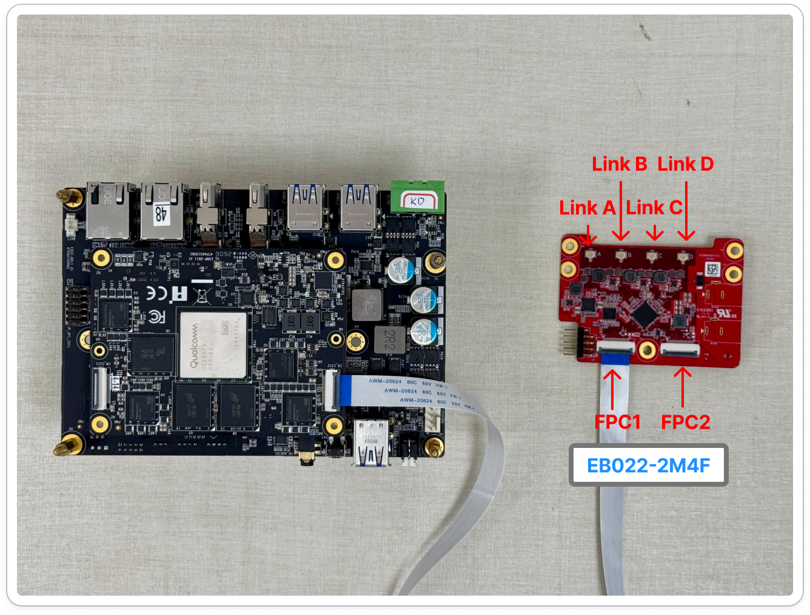
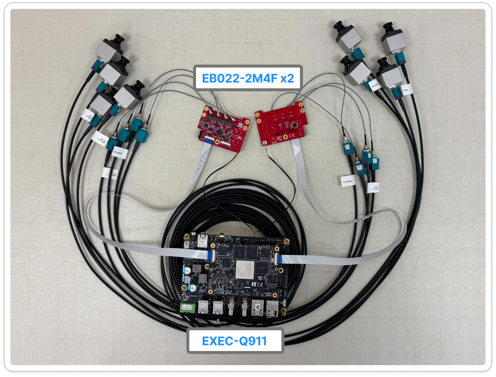
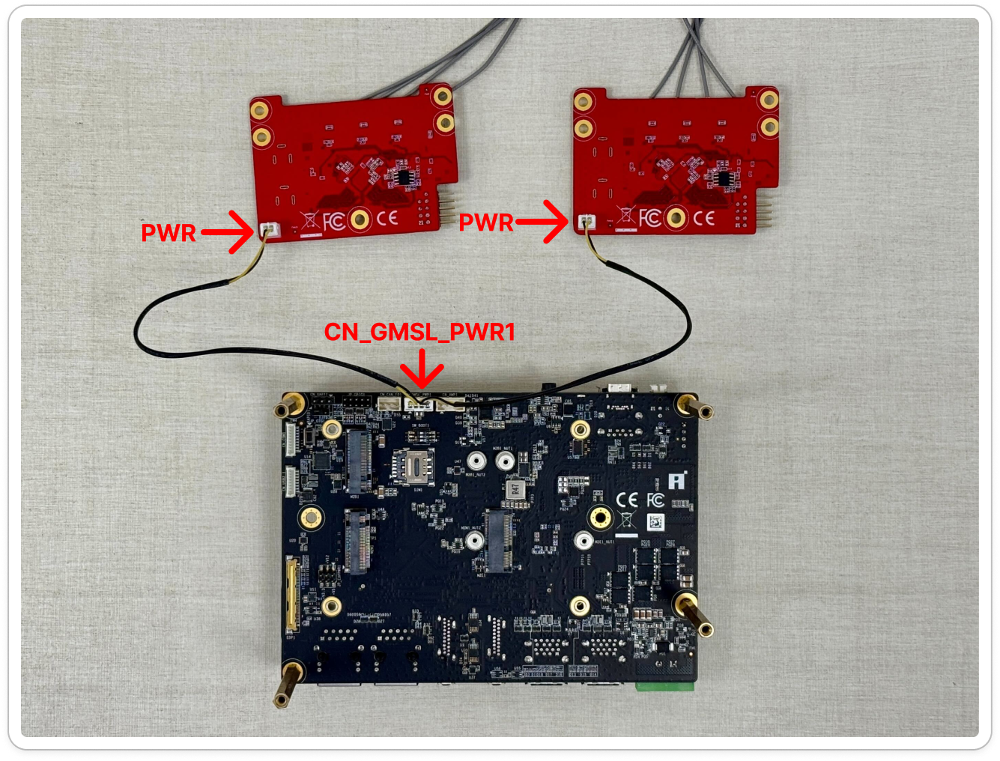
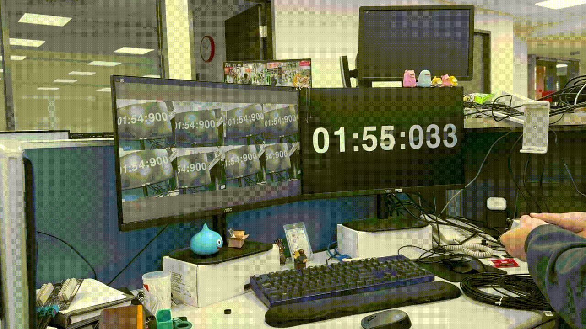

# GMSL Camera

GMSL provides a highly flexible interface for camera installation. 

Unlike MIPI CSI-2, which typically supports only short-range connections of several tens of centimeters, GMSL enables long-distance video transmission up to 10–15 meters over a single coaxial cable. This allows cameras to be placed several meters away from the platform while maintaining low latency and high reliability.

GMSL is widely used in autonomous driving, industrial mobile equipment, 360° surround-view stitching, and multi-channel real-time AI recognition applications.

## Supported Components

To build a GMSL vision system, the following components are required:

- **Cameras**: [EVDF-OOM1](https://www.innodisk.com/en/products/camera/gmsl2/evdf-oom1-rhcf), [EV3F-ZSM1](https://www.innodisk.com/en/products/camera/gmsl2/ev3f-zsm1-rxcf)
- **Adapter Boards**: [EB022-2M4F](https://www.innodisk.com/en/products/camera/adapter-board/eb022-2m4f)
- **Evaluation Kits**: [EXEC-Q911](https://www.innodisk.com/cht/products/computing/qualcomm-solution/EXEC-Q911)
- **Mezzanine Board**: [Qualcomm GMSL Mezzanine](https://docs.qualcomm.com/bundle/resource/topics/80-70020-17A/connect-camera-sensor-hardware.html)
- **Operating Systems**: [Yocto Linux](https://docs.qualcomm.com/doc/80-70029-254/topic/build_addn_info.html?product=895724676033554725&facet=Build%20Guide&version=1.8)

## Camera Matrix
 
Specific connection procedures vary depending on the target platform. Follow the instructions below for your specific hardware. 

### Connecting to EXEC-Q911

The EXEC-Q911 supports multi-channel GMSL input via the EB022-2M4F adapter board.

| Module    | Support Platform | Adapter Board | Supported OS                        | CN_CSI1 | CN_CSI2 | Resolution, Frame Rate |
| --------- | ---------------- | ------------- | ----------------------------------- | ------- | ------- | ---------------------- |
| EVDF-OOM1 | EXEC-Q911        | EB022-2M4F    | Yocto Linux 1.6  | ✅      | ✅      | 1920x1080, 30 FPS      |
| EV3F-ZSM1 | EXEC-Q911        | EB022-2M4F    | Yocto Linux 1.6 | ✅      | ✅      | 1920x1536, 30 FPS      |

> ✅ Supported | ❌ Not supported | ☑️ Coming soon

<div align="center">
  
</div>

To connect the GMSL camera to the EXEC-Q911 using the EB022-2M4F adapter board, follow these steps:

1. Use a 22-pin to 22-pin MIPI cable (A-B style) to connect `CN_CSIx` on the platform to the corresponding `FPC1` header on the adapter. This specific cable type is essential for correct CSI lane alignment.
2. Power on the EB022-2M4F first, followed by the EXEC-Q911.

<br />
<br />

### System Reference Diagrams

The following diagrams provide additional context for complex multi-camera and power configurations.

<div align="center">
  <table style="border: none;">
    <tr>
      <td align="center" style="border: none;">
        <br>
        <i>8-Channel Reference Diagram</i>
      </td>
      <td align="center" style="border: none;">
        <br>
        <i>PP19 Power Reference Diagram</i>
      </td>
    </tr>
  </table>
</div>

<br />
<br />

## How to Install
For detailed, step-by-step instructions for both Yocto Linux please refer to the **[Installation Guide](./install.md)**.

## How to Use

If the camera is properly connected and the required drivers are installed, you can use GStreamer to interact with the camera streams.

> 🔔 **Note:** For **Yocto Linux**, suppress kernel messages before running pipelines: `echo 0 > /proc/sys/kernel/printk`

> 🔔 **Note:** If `HMSMaxDelayedJobCount` has not yet been added to `/var/cache/camera/camxoverridesettings.txt`, you can refer to the following to add it:
> ```bash
> echo "HMSMaxDelayedJobCount=8" > /var/cache/camera/camxoverridesettings.txt
> ```

> 🔔 **Note:** All of the following example usages require a **DP (DisplayPort)** connection to view the live stream output.

### 1. Single & Dual Channel Stream

The [`2ch_display.sh`](../../utils/common/2ch_display.sh) script displays live GMSL video streams on the Wayland display.

Run it on the target:

```bash
./utils/common/2ch_display.sh
```

> 🔔 **Note:** This script supports **1–2 streams** only (`camera=0` and `camera=1`). For more than two channels, use the Octuple Channel Stream scripts below.

### 2. Octuple Channel Stream
The following scripts demonstrate how to display 8 channel GMSL video streams. Each script applies the required `camxoverridesettings.txt` configuration, restarts `cam-server`, and launches all eight channels on the Wayland display.

Choose the script matching your camera module and run it on the target:

```bash
# EV3F-ZSM1 (1920x1536, 8-Channel Display)
./utils/common/ev3f_8ch_display.sh

# EVDF-OOM1 (1920x1080, 8-Channel Display)
./utils/common/evdf_8ch_display.sh
```

---

<div align="center">
  <table style="border: none;">
    <tr>
      <td align="center" style="border: none;">
        <br>
        <i>Dual Channel Stream</i>
      </td>
      <td align="center" style="border: none;">
        <br>
        <i>Octuple Channel Demo</i>
      </td>
    </tr>
  </table>
</div>


## How to Switch Modules

Please refer to **[Installation Guide](./install.md)**, reinstall the module package (tar.gz) you want to install, and then reboot the system to replace the module.

## FAQ

For frequently asked questions and troubleshooting tips, please refer to the **[FAQ Guide](./faq.md)**.