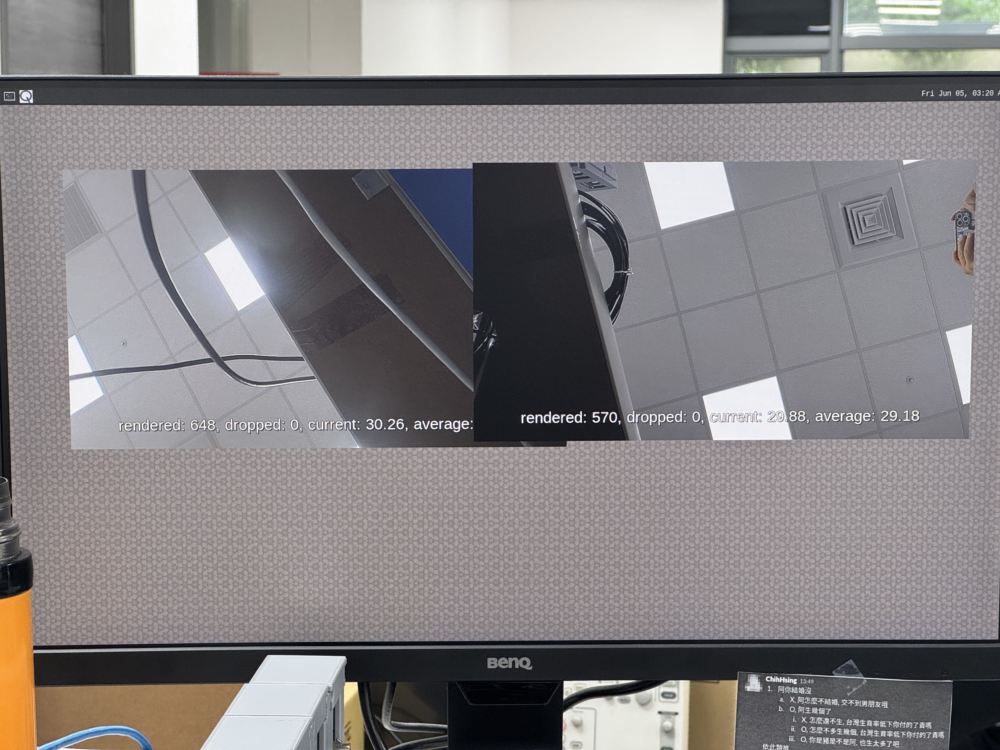

# MIPI Camera

MIPI CSI-2 is a widely adopted camera interface standard designed for high-bandwidth, low-power, and low-latency transmission between image sensors and processing SoCs.

It supports multi-gigabit throughput per lane, enabling high-resolution and high-frame-rate video pipelines for modern imaging applications.

With its mature ecosystem and broad sensor compatibility, MIPI CSI-2 is commonly used in autonomous driving, industrial automation, robotics, medical imaging, and AI edge devices.

> 💡 **Tip:** You can check out **[iQS-Streampipe](../../applications/iqs-streampipe/README.md)** to see how to run multi-stream applications on our platform.

## Supported Components

To build a MIPI vision system, the following components are required:

- **Cameras**: [EVDM-OOM1](https://www.innodisk.com/en/products/camera/mipi-csi-2/evdm-oom1-rhcf), [EV2M-OOM3](https://www.innodisk.com/en/products/camera/mipi-csi-2/ev2m-oom3-rhcf), [EV8M-OOM1](https://www.innodisk.com/en/products/camera/mipi-csi-2/ev8m-oom1-rhcf)
- **Evaluation Kits**: [EXEC-Q911](https://www.innodisk.com/cht/products/computing/qualcomm-solution/EXEC-Q911)
- **Operating Systems**: [Yocto Linux](https://docs.qualcomm.com/doc/80-70029-254/topic/build_addn_info.html?product=895724676033554725&facet=Build%20Guide&version=1.8)

## Camera Matrix

Specific connection procedures vary depending on the target platform. Follow the instructions below for your specific hardware.

### Connecting to EXEC-Q911

| Module    | Support Platform | CN_CSI1 | CN_CSI2 | Resolution, Frame Rate |
| --------- | ---------------- | ------- | ------- | ---------------------- |
| EVDM-OOM1 | EXEC-Q911        | ✅      | ✅      | 1920x1080, 30 FPS      |
| EV2M-OOM3 | EXEC-Q911        | ✅      | ✅      | 1920x1080, 30 FPS      |
| EV8M-OOM1 | EXEC-Q911        | ✅      | ✅      | 1920x1080, 30 FPS      |

> ✅ Supported | ❌ Not supported | ☑️ Coming soon

<div align="center">
  
</div>

To connect the camera to the EXEC-Q911, follow these steps:

1. Use a 22-pin to 22-pin MIPI cable (A-B style) to connect `CN_CSIx` to the camera. This specific cable type is essential for correct CSI lane alignment.
2. Power on the EXEC-Q911.

## How to Install

For a complete walkthrough of the setup process for both Yocto Linux systems, see the **[Installation Guide](./install.md)**.

## How to Use

If the camera is properly connected and the required drivers are installed, you can use GStreamer to interact with the camera streams.

> 🔔 **Note:** For **Yocto Linux**, suppress kernel messages before running pipelines: `echo 0 > /proc/sys/kernel/printk`

> 🔔 **Note:** If `HMSMaxDelayedJobCount` has not yet been added to `/var/cache/camera/camxoverridesettings.txt`, you can refer to the following to add it:
> ```bash
> echo "HMSMaxDelayedJobCount=8" > /var/cache/camera/camxoverridesettings.txt
> ```

> 🔔 **Note:** All of the following example usages require a **DP (DisplayPort)** connection to view the live stream output.

### Single & Dual Channel Stream

The [`2ch_display.sh`](../../utils/common/2ch_display.sh) script displays live video streams on the Wayland display.

Run it on the target:

```bash
./utils/common/2ch_display.sh
```

> 🔔 **Note:** This script supports **1–2 streams** only (`camera=0` and `camera=1`).



## How to Switch Modules

Please refer to **[Installation Guide](./install.md)**, reinstall the module package (tar.gz) you want to install, and then reboot the system to replace the module.

## FAQ

For frequently asked questions and troubleshooting tips, please refer to the **[FAQ Guide](./faq.md)**.